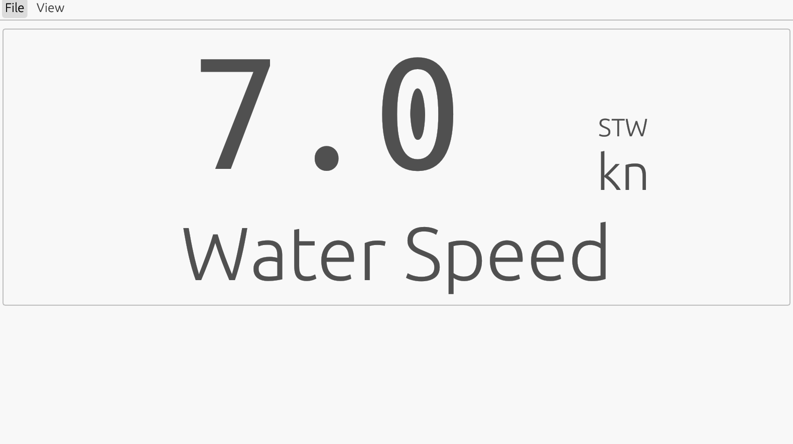
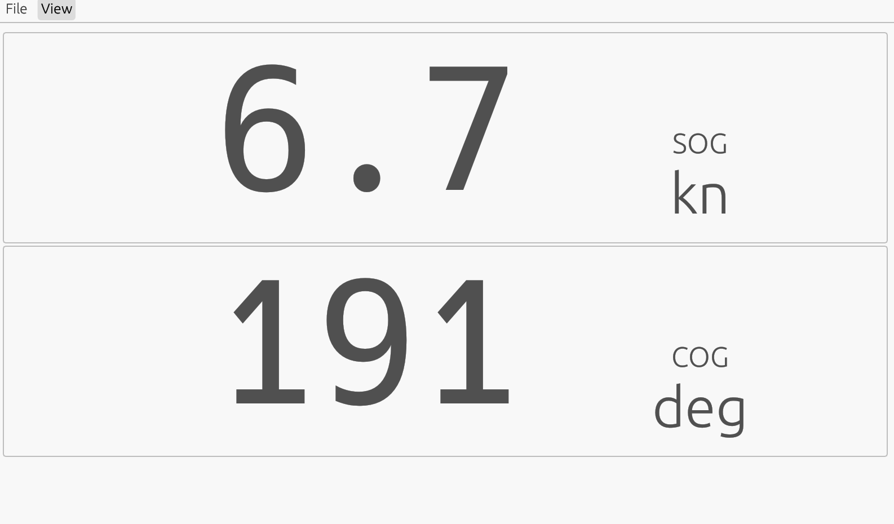

SignalK Multidisplay
====================

This app reads data from a SignalK server
and displays multiple of them.

The design is inspired by Garmin GNX-20 and B&G Triton.

Current status
==============

You can see the display in action on the
[demo page](https://balp.github.io/signalk-multidisplay/demo/).

The order of display and coded into the app at the moment.
It haz a dual display, then two single pages each showing for
a second each:

A single value page, the values on each page can be changed:

A dual view page, the values and units can be changed.

You can also configure the server to get data from. The SignalK demo server at https://demo.signalk.org/signalk.